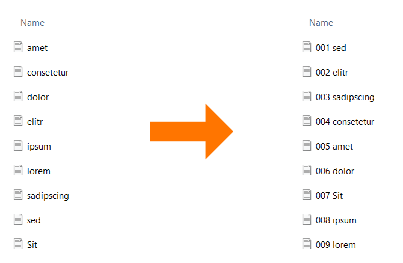

# Enumerate Files

A python script to easily number your files by their creation date.



## Getting Started

This project requires [Python 3](https://www.python.org/downloads/) to be installed on your machine, and only works on Windows.

The script can be executed with the following command:

```console
python main.py
```

Next the script will ask for certain parameters like location of the folder. After entering all parameters a preview of the renamed files will be shown.

## Features

The following aspects can be customized:
- Number of leading zeros
- Start Number
- Gaps in Enumeration (e.g. skip 7 to 12)
- Order of Enumeration (ascending/descending)
- Seperator after Enumeration (e.g. 001_xx, or 002-xx)
- Remove Enumeration

## Resources

A very usefully tool for batch renaming files is [PowerToys](https://learn.microsoft.com/en-us/windows/powertoys/) from Microsoft.
